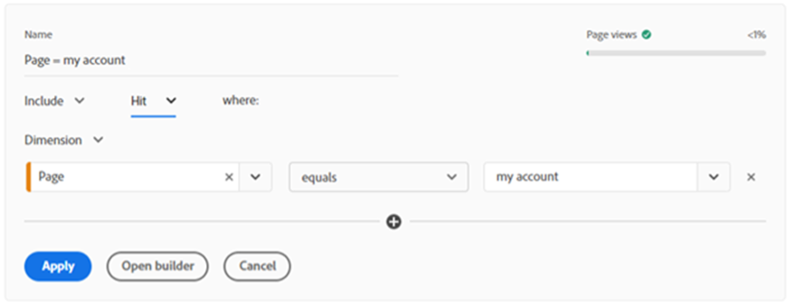

# Analysis Workspace中區段產生器與快速區段之間的差異

區段可以是資料分析工具套件中最強大的工具之一。 了解在Analysis Workspace中使用區段產生器和快速區段以提高效率的差異。

>[!TIP]
>
> 按一下頁面底部的影像，即可下載Analysis Workspace中每個工具的使用時機提示。

區段可以是資料分析工具套件中最強大的工具之一。 當您想要查看特定流量群組、網站區域或客戶歷程時，使用區段是將分析聚焦於網站特定流量子集的絕佳方式。 來自零售環境，我製作的某些最實用區段適用於不同類型的客戶群組，例如新客戶與現有客戶、登入帳戶的客戶與訪客等。 但您也可以針對不同的網站區域、執行特定動作的客戶，或您可以想到的其他任何項目進行建立！

**建立區段的主要方式有兩種：**

* 在元件功能表中使用區段產生器
* 使用面板頂端的快速區段

如果您使用區段產生器建立區段，則可儲存區段以在其他專案中重複使用。 這是專注於特定客戶群的絕佳方式，例如，造訪網站特定區段然後進行購買的人。 另一方面，如果您進行探索性分析，並想要測試不同的區段設定，快速的區段產生器將是絕佳的協助。 讓我們來看看每種方法的一些主要優點。

## 快速區段

在每個面板頂端，您可以按一下快速區段圖示（帶有+號的漏斗）以開啟產生器。 這可讓您在任何層級（點擊、造訪或訪客）建立區段，最多包含三個條件。 與主要區段產生器類似，這可在右側提供指示，指出區段是否傳回資料，以及區段中包含之總流量%，不過此版本比區段產生器中顯示的完整區段量檢視更簡化。 新增多個條件時，您可以使用「和」和「or」運算子。 很可惜，快速區段沒有「then」選項，因此若您需要循序區段，則需要使用完整的區段產生器。 快速區段中也有一個容器的限制。 因為這實際上是要用於快速製作和編輯的基本區段。 將快速區段套用至面板或儲存後，就無法再在面板中編輯該區段。

進行探索性分析時，您想要測試不同類型的區段，以查看不同客戶群組的反應或不同類別的執行情形 — 使用快速區段的速度比使用區段產生器快得多。 此外，這些區段僅可在其建立的專案中使用，因此如果結果不提供您想要的結果，您就不需擔心從主清單中刪除儲存的區段。 如果在測試區段後，您發現該區段在其他專案中會很實用，您隨時可以按一下「開啟產生器」按鈕，在完整的區段產生器中開啟區段，以將其儲存為一般區段。 不過，一旦您這麼做，就無法在快速區段產生器中編輯它。

## 區段產生器

您可以按一下左側元件功能表中區段清單上方的+號，或按一下元件下拉式清單並選取「建立區段……」，存取區段產生器，這和快速區段不同，提供所有可用選項。 若要新增多個條件，您可以使用&#39;then&#39;運算子建立循序區段。 循序區段也可讓您使用「邏輯群組」作為層級（而非點擊、造訪或訪客）。 區段產生器也可讓您新增說明至區段，以新增關於建立區段的人員或已建立以篩選的資料類型的內容，或甚至只新增「標籤」至區段以供組織用途，兩者在快速區段產生器中皆無法完成。

如果您需要使用容器或想要循序區段，當您的區段將會有3個以上條件時，使用區段產生器是必不可少的。 完整的區段產生器有更多選項可建立更複雜的區段，可協助您劃分不同的客戶類型、類別、客戶歷程等。 建立並儲存這些區段後，這些區段就會新增至區段的主清單，這表示這些區段可以經過標籤、核准、共用、用於多個報表，並發佈至Experience Cloud。 在Experience Cloud中發佈可讓您在其他Adobe產品(例如在Adobe Target中)中使用區段，以進行個人化鎖定目標。 在區段產生器中建立的區段無法在快速區段面板中編輯，您必須開啟區段產生器，才能對它們進行任何變更。 所幸的是，右側的預覽視覺效果可更詳細地分析區段過去90天內傳入的流量，這表示在儲存前可更輕鬆確定區段傳入的是您想要的。

## 使用個案

在不同的產業中，您建立自訂區段的用途可能會有所不同。 我們為大型零售商的電子商務部門工作，通常會執行探索性分析，以判斷客戶採取哪些路徑進行購買。 當我們看到動作出現尖峰或下降時（例如將產品新增至購物車或下單），即可方便使用快速區段。 在分析期間，我可以快速為特定類型的客戶或他們點按的特定動作/連結建立區段。 不需要開啟區段產生器並儲存每個區段，我可以快速新增條件，然後像快速移除一樣快速。 這可節省大量時間來解釋為何我們的網站出現變更。

或者，有時候我會選擇使用區段產生器。 並非每個客戶都是相同的，我們通常想要透過他們採取的動作或路徑來識別特定類型的客戶。 使用區段產生器時，我們可以新增多個條件來識別不同的客戶類型並儲存區段，以便多個分析人員共用及使用。 請務必讓這些類型的區段在各報表間保持一致，這樣一來，由於結果可能不同，建置出可供每個人使用的區段，效果會比建置自己版本的人好。

整體而言，快速區段和區段產生器都是用於分析的絕佳工具。 它們各有其目的、優點和缺點。 如需快速參考指南，請務必查看下方的實用提示和秘訣說明。

## 作者

本文件的作者為：

**曼迪·喬治**，百思買加拿大的數位分析師III

Adobe Analytics 達人

## 下載

