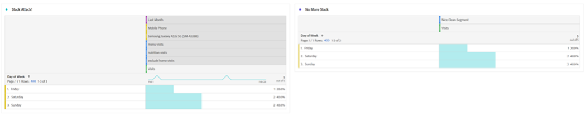

# 現在只需等待區段……使用區段來探索Analysis Workspace中的新深入分析

無論您是新的Adobe Analytics使用者或經驗豐富的專業人員，都會在您的Analysis Workspace專案中運用相當多的區段。 As [Adobe Experience League](https://experienceleague.adobe.com/docs/analytics/components/segmentation/seg-overview.html?lang=zh-Hant) 說明：「區段可讓您根據特性或網站互動來識別訪客的子集。」 雖然此功能的基本結果意味著將使用者、造訪或網站點擊群組隔離，但像您這樣的頭腦敏銳的分析師可運用此工具發揮創意，並尋找新方式來獲得您網站活動的深入分析。 可能的選項清單很多，因此您可以嘗試建立自己的選項，並與組織中的其他人或線上(如 [Adobe Analytics社群](https://experienceleaguecommunities.adobe.com/t5/adobe-analytics/ct-p/adobe-analytics-community) Experience League或 [#MeasureSlack](https://www.measure.chat/) 社群。

若您需要快速重新整理以了解如何建立區段，請查看有關使用的Experience League檔案 [區段產生器](https://experienceleague.adobe.com/docs/analytics/components/segmentation/segmentation-workflow/seg-build.html?lang=en) 在Analysis Workspace。

## 比較和對比區段

在Analysis Workspace中，您可以使用「[區段比較](https://experienceleague.adobe.com/docs/analytics/analyze/analysis-workspace/panels/segment-comparison/segment-comparison.html?lang=zh-Hant)」。 區段比較可在左側導覽列的「面板」區段中找到：

不過，有時候您不需要完整的比較面板，就能向使用者提供主要分析。 值得慶幸的是，一些功能也可以在標準面板中進行比較。

此 [文氏圖視覺效果](https://experienceleague.adobe.com/docs/analytics/analyze/analysis-workspace/visualizations/venn.html?lang=zh-Hant) 可協助您建立快速比較，讓您暫留並查看重疊的工作階段、訂單、使用者等。 介於2到3個自訂區段之間。 您也可以以滑鼠右鍵按一下任何重疊的區段，以快速建立區段：

有時重要資訊不在重疊的資料中，而是不重疊的資料。 檢視此資訊的快速方式是建立一個區段的復本，並將其設為「排除」區段：

現在，將「排除」區段與比較中的其他區段堆疊在一起，即可快速計算點擊您的功能表頁面的造訪次數，而不需在相同工作階段中檢視首頁：

## 堆棧攻擊

同樣地，您也可以將任何區段堆疊在一起，以建立Venn圖表的相交資料。 堆疊的區段或個別維度數量沒有限制。 例如，如果我想快速了解上個月的「星期幾」，我的網站在手機上瀏覽了哪些內容，尤其是三星Galaxy A52，它的確看到了我的菜單和營養頁面，但沒有看到我的首頁，我可以像這樣快速地構建它：

但更棒的是，一旦我找到完美的使用者或造訪基數子集，就能選取所有這些值，按一下滑鼠右鍵，然後立即建立區段：

這是一個部分的力量。

## 數個區段的數字區段

許多使用者在建立區段時，通常會查看名義值、序數值或間隔值，例如已造訪的頁面、使用者的年齡範圍或使用者過去的造訪次數。 不過，在建立區段時，您也可以分段這些值，以利使用比率資料，無論這些值是貴組織的標準維度、標準量度，或自訂變數和量度。

例如，「頁面逗留時間」或「每次造訪逗留時間」有預先建立的可用貯體：

不過，這些變數可能並不總是符合您組織的需求 — 可能網站的大部分造訪時間都會少於10分鐘。 您可以使用粒度測量來建立大小不同的貯體。 以下是一個建立用來查看持續1分鐘、1秒和1分30秒之間的造訪：

建立後，我現在可以開始依照我自訂的不同分段時間群組來查看我的造訪、訂單和其他事件：

您甚至可以開始檢查關鍵績效指標(KPI)的變更程度，了解使用者花費的時間、在一次瀏覽中點擊了多少頁面、過去曾瀏覽過多少次，或任何其他數值，這基本上可讓您將量度視為其他量度的因素：

使用區段來尋找新深入分析的可能性無限！ 這只是一個起點。 請自行嘗試一些，並讓社群了解您所發現的內容： [Adobe Analytics社群](https://experienceleaguecommunities.adobe.com/t5/adobe-analytics/ct-p/adobe-analytics-community) Experience League或 [#MeasureSlack](https://www.measure.chat/) 社群。

快樂的分詞！

## 作者

本文件的作者為：

**丹·卡明斯**,McDonald&#39;s Corporation資深產品工程分析經理

Adobe Analytics 達人

