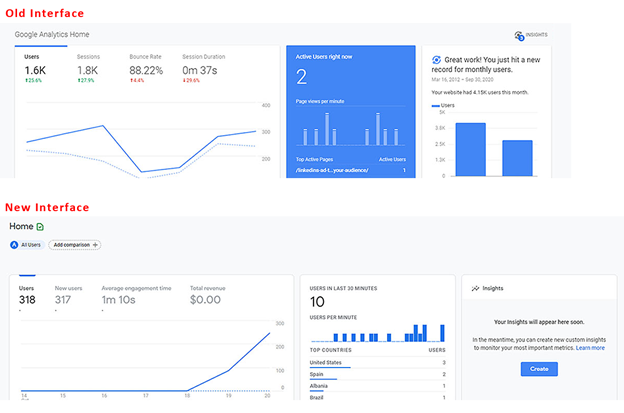

# 從 Google Analytics 轉換到 Adobe Analytics 的全方位指南

## 1. 簡介

在任何工具之間轉換的最大挑戰之一，就是了解應該從何處尋找同等的功能並了解如何有效率地使用該功能。本討論內容是幫助使用者更輕鬆地轉換到 Adobe Analytics 的大型指南的一部分，無論是新的使用者，還是來自 Google Analytics 的使用者。提供與 GA 的深入比較 (這是大多數使用者最有可能熟悉的比較工具)，以幫助使用者將現有知識與新的工具集建立關聯。雖然沒有什麼東西可以取代實務，但此內容將幫助您入門，也希望能夠減少您在這期間可能會遇到的挫敗感 (或甚至是在您開始涉足實務之後當作複習資料)。

我們也應該來快速比較一下術語：

| **說明** | **Adobe Analytics** | **Google Analytics** |
|--------------------------------------------------------------------------------------------------------------------------------|---------------------|----------------------|
| 代表某個頁面 (或應用程式上的某個畫面) 已被瀏覽的事件量度 | 頁面瀏覽數 | 網頁瀏覽量 |
| 代表您的網站或應用程式上發生在相同時間範圍內的一組互動的量度 | 瀏覽 | 工作階段 |
| 定義已識別之裝置的量度 (根據多個條件，包括 Cookie 和其他行為模式以拼接使用者資訊) | 不重複訪客 | 使用者 |

## 2. 介面

當人們在比較 Adobe Analytics 與 Google Analytics 時，我最常看到的事情之一就是 Adobe 有很多事情要做 - 這讓人們望而生畏。這是真的，但信不信由您，這也是一種優點，而不是弱點。Adobe 為您的資料視覺化提供各式各樣的工具和靈活性，讓您擁有更大的自由度可以打造所需的東西。

讓我們先來審視「網站內」報告。

### 2.1. 網站內報告

#### 2.1.1. 首頁畫面

Adobe Analytics 和 Google Analytics 都有提供方式讓您自訂使用者登入時最先看到的檢視畫面。

##### 2.1.1.1. 工作區/自訂首頁畫面 (Adobe Analytics)

Adobe Analytics 不會擅自為所有登入的使用者預先建立報表以供他們查看。預設首頁會帶領使用者前往工作區登陸畫面，該畫面將為每個使用者顯示他們所建立或是他人與其分享的所有工作區報表。此外，每個使用者也能夠選擇將任何報表設定為首頁。

本指南的稍後章節將提供有關工作區的更多詳細資訊。請參閱第 2.1.2.1 小節

>[!TIP]
>
>請為貴組織的成員建立/分享一些標準報表，好讓他們有一個起點可查看資訊，而不需要立刻著手建立自己的報表。

##### 2.1.1.2. 首頁畫面深入解析 (Google Analytics)

* Google Analytics 首頁畫面已為您預先建立了一些視覺效果。其中涵蓋：
* 過去 7 天的使用者、工作階段、跳出率和工作階段持續時間
* 依據一天當中的時間列出過去 30 天的使用者
* 目前的使用者及最活躍的頁面
* 過去 7 天的流量管道、來源/媒體及轉介
* 依國家/地區列出過去 7 天的工作階段
* 過去 7 天的熱門頁面
* 過去 30 天的活躍使用者趨勢
* 及更多內容

在 GA4 中，使用者有更多選項可以自訂首頁畫面，並將自己的報表新增到該畫面。

當您來到 Adobe 之後，這可能是您最想念的一件事；Adobe 不會為您預先建立這種首頁畫面，但您可以輕鬆地設定自訂工作區，從上面複製您需要的東西，也可以選擇將其設定為登陸畫面。稍後有提供更多相關內容 (或請參閱第 2.1.2.1 小節 - Adobe Workspace)。

#### 2.1.2. 網站內 Report Builder

除了分析工具提供的簡單報表之外，每個工具都有提供更多強大的工具，讓您可用來建立自己的自訂報表。

##### 2.1.2.1. Adobe Analytics Workspace

這是 Adobe Analytics 的動力來源，自從它在 2017 年推出以來，就成為了 Analytics 分析的首選之地，也是「報表」區段即將成為明日黃花的主要原因。

此工具讓您在建立報表時幾乎擁有完整的自由度。

報表可以分成多個面板，而這些面板可包含任意數量的視覺效果。面板可以設定為常用資訊，例如日期範圍及常用區段篩選器。

面板及面板內的視覺效果都可以調整大小並四處拖曳，以並排或堆疊方式顯示項目。所以，如果您想要並排比較兩組不同的資料，可以建立以 50/50 方式在中間拆分的面板，並排顯示兩個網站以方便比較。

我們有許多視覺效果可供使用者使用：

* 自由格式表格
* 同類群組表格
* 流失
* 流量
* 圖表
   * 區域圖 (堆疊和非堆疊)
   * 折線圖
   * 散佈圖
   * 橫條圖 (堆疊和非堆疊)
   * 項目符號
   * 環形圖
   * 長條圖
   * 水平橫條圖 (堆疊和非堆疊)
* 地圖
* 摘要區塊
   * 摘要變更
   * 摘要文字
   * 文字 (可輸入額外資訊來提供上下文的自由文字欄位)
* 文氏圖表

每個面板和視覺效果都可以加上標題並套用說明，以提供上下文幫助使用者了解所顯示的資訊。
在 Adobe 中，區段 (尤其是資料的篩選器) 可回溯性地套用，而且這些區段可以拉進自由格式表格中的欄，以便並排比較資料。舉例來說，如果使用者想要比較其網站上兩個不同類別的流量，他們可以為「類別 A」建立一個區段，並為「類別 B」建立另一個區段。

自由格式表格允許您擁有多欄及分段效果，好讓您依您想要的方式將資料視覺化。

根據上圖，您會不想要依日期劃分資料嗎？只需將另一個維度或區段拖放到該處，就能以不同的方式查看資料… 例如，可能將區段用於「裝置類型」，然後為「行動裝置/平板電腦」使用者新增依作業系統的劃分：

工作區可讓您自由發揮創意，而不受限於「標準」劃分。您可以建立所需的視覺效果以深入探究您需要進行的比較。

>[!TIP]
>
>不用害怕實驗和探索，這裡有許多方式可讓您跳脫傳統的思維框架，看看自己可以做哪些事！但也務必試著驗證您所建立的東西是否真正展示了您的想法。這裡的體驗會有所幫助！

您甚至可以建立僅存在於報表中的即時計算量度或區段，以防止資料淹沒您的區段和計算存放庫，也可確保您可以建立特定報表所需的重點項目，而不會將您的組織與其他情況下不太有用的東西相混淆。

本討論內容只是為了介紹這個工具，還有其他更完整的指南可幫助您入門，當您探索這些指南時，將能夠製作全方位的報表，例如：

也應該注意一件事：工作區不會自動儲存，所以進行一次性的臨時報告會比較容易，這樣就不會塞滿報表存放庫。

工作區有另一個強大的功能，就是能夠以下拉清單形式將互動式修飾詞套用到您的報表。雖然這些下拉清單不適用於報表的 CSV 或 PDF 匯出檔案，但是在即時報表中可讓您更新面板中的所有視覺效果，以便在不同條件下顯示相同報表。可以使用多個下拉清單，而且只要選項不互斥，選取的項目就會堆疊起來，以簡潔的方式呈現資訊。

>[!IMPORTANT]
>
>若要進一步了解如何使用下拉清單和自由格式劃分，請參閱 <https://experienceleaguecommunities.adobe.com/t5/adobe-analytics-discussions/the-power-of-dropdown-filters-and-dimension-breakdowns-in-adobe/td-p/434680>

##### 2.1.2.2. Google Analytics：儀表板、自訂報表和儲存的報表

Google 有一些工具可以在介面中建立報表，但還是要遵循報表區段的相同顯示方式並受其限制。

現在，對於哪些精通 Google Analytics 的人來說，當您讀到這段文字時，可能想要說：「等等，那麼 Google Data Studio 呢？它不是相當於 Adobe Workspace 而且更出色嗎？」您說的沒錯，但因為 Data Studio 在技術上並不是 Analytics 工具的一部分，而且可連線到不同資料來源，所以我們會在稍後的「擴充的報表存取」一節 (及特定的第 2.2.3 小節) 中談到這個工具

Google 儀表板和自訂報表可讓您將多個視覺效果一起提取到一個報表中，但不同於工作區，您仍然受限於簡單的關聯以及可以將哪些資料放入哪些欄。

在自訂報表中，最大挑戰之一是當您建立篩選器時，它會套用到報表中的所有索引標籤…無法在相同報表中比較兩個不同的篩選器。

如果是表面的比較，則可以順利進行。這些全都類似於 Adobe 舊式儀表板、自訂報表和書籤。提供基本工具是為了支援您在報表套裝中的需求。

#### 2.1.3. 報表

Google 和 Adobe 都有一些可導覽的報表，這些報表是根據維度的隨建表格及基本時間軸圖表。

##### 2.1.3.1. Adobe Analytics 報表

Adobe Analytics 也有「報表」區段，儘管這在很大程度上已處於淘汰階段，將由其 Analysis Workspace 所取代 (事實上，此介面已公佈生命週期即將結束，因為工作區[第 2.1.2.1 小節]是更強大的工具)，利用後者可以更輕鬆地建立及修改這些表格的大多數。Adobe 的區段更加細分，這可能令人生畏：

上述的大多數內容都可透過工作區存取，我將簡短概述這些區段以及它們與 Google Analytics 的關係，並強調在此依然相關的報表。

網站量度是您期望的指標，它涵蓋標準量度 (頁面瀏覽數、不重複訪客、造訪次數以及您已設定的自訂事件)。這類似於行為報表 GA，但也包含一些您在 Audience 中可以找到的量度 (因為 Adobe 不會拆分量度類型)。

您也可以在這裡找到「機器人」報表，所有標準報表都會排除來自機器人的流量，不過，有兩個報表可讓您深入了解正在發生的事情以及哪些機器人正在瀏覽您的網站。如果您有設定自訂「機器人規則」以排除經常造訪您網站的已知垃圾內容機器人，這會特別有用。您可以獲得這些機器人正在做什麼的洞察資訊，但又不會讓這些流量在您的主要報表中氾濫。目前無法透過工作區取得機器人報表 (但即將推出的新報表功能也可讓使用者在該處取得此資訊)。

網站內容是一組 Adobe 標準維度：頁面名稱、網站區段 (頻道)、階層 (在網站內建立組織的自訂深入研究報表的一種方式)、伺服器 (如果您在網站上有多個子網域或是要將多個網站一起標記到一個追蹤套件中，這會特別有用) 等。工作區有提供所有這些資料。

「行動」是一組行動裝置特有的資料，例如裝置、裝置類型等。工作區有提供所有這些資料。

「路徑」是另一個在「工作區中不太可用」的項目…雖然工作區確實有「流程」圖表，但您只能看到單一頁面/值的進出流量…而「路徑」則可讓您查看網站中最常用的路徑。根據預設，「頁面」是第一個為您設定的路徑報表，但您可以針對自訂 prop 將其開啟 (例如，如果您要追蹤「頁面類型」值，可以查看頁面類型中的路徑分析)。我個人喜歡「路徑」的另一個原因是因為這是簡單的資訊呈現方式…工作區中的流程圖表 (取決於您要查看多少內容) 可能會讓人吃不消。我建議您兩者都去嘗試，它們有各自的用途及價值，您的選擇取決於您想要達成的目的。請注意，任何維度都可以在「流程」中使用，但「路徑分析」則必須在管理員面板中的 Prop 上設定。

流量來源、行銷活動和行銷管道報表都類似於 Google 中的攬客報表。流量來源聚焦於實際反向連結、行銷活動聚焦於您的行銷活動代碼，而行銷管道也聚焦於行銷活動代碼，但也會套用您決定的有關資訊處理方式的額外邏輯。我發現 Adobe 在如何設定規則方面為您提供更大的自由度，而 Google 則為您做許多事，所以這將會是一種思維轉換。也請注意一點，根據預設，Google 對行銷活動代碼的歸因為 6 個月，Adobe 的預設值則為 1 週。您可以在管理員設定中加以變更，但在工作區內，您實際上可以在任何維度之上套用自訂歸因，進而為您提供更大的「即時」靈活性。

「訪客保留率」和「訪客資料」報表類似於 Google Analytics 中的目標對象報表。「訪客保留率」比較關注返回頻率，而「訪客資料」則比較關注使用者的地理位置和技術。

「自訂轉換」和「自訂流量」都是自訂維度報表，轉換是您的 eVar (您可以在 eVar 上設定該值的自訂到期時間 - 亦即點擊、瀏覽、月份、年份等，而且除非被覆寫，否則這個值將為使用者保留指定的時間)。流量變數是您的 prop，但您也可以為「路徑報表」設定這些變數，或將其設定為清單項目 (這將根據您選擇的分隔符號拆分多個值)。

「媒體」適用於您設定了特殊媒體追蹤的視訊或音訊等檔案。

「自訂報表」是使用者可以在上面自訂欄和劃分的區段，他們已在報表介面中建立這些欄和劃分，並將其儲存為自訂報表。不過，如上面所述，由於工作區允許更強大的劃分和關聯，所以任何自訂作業都應該在那裡進行。這在工作區存在之前是很好的解決方案。

「書籤」區段類似於「自訂報表」，可以在報表介面中為常用的報表添加書籤，以便可以更輕鬆地找到它們。

「儀表板」是一種舊式產品，可讓人們將資料的小報告一起合併到一個視覺效果中。不過，工作區 (第 2.1.2.1 小節) 中的功能使用起來要容易得多，它只會當作存取點存在，讓人存取在此功能被淘汰之前應該重建的舊式報表。

「目標」是一個特殊報表區域，可讓人們在特定時間範圍內根據目標建立報表，以便團隊可以監控類似行銷活動等內容，並了解他們是否有望實現流量目標。

這裡的所有報表都允許多個量度欄和維度劃分。但視覺效果的簡單性以及哪些元素可建立關聯的一些背後邏輯有時可能會讓人感到挫折。

##### 2.1.3.2. Google Analytics 報表

Google Analytics 將這些報表拆分成以下區段：即時、目標對象、攬客、行為和對話 (在 GA3 中)，並拆分成生命週期 (包含子區段：攬客、參與度、營利、回訪率) 和使用者 (包含子區段：人口統計和技術)。

您可以對這些視覺效果進行一些細微調整、新增次要維度劃分、變更視覺效果、建立資料篩選條件等。您可以將自訂內容儲存為「已儲存的報表」，

這可讓您輕鬆又快速地洞察您的資料。不過，您無法將「使用者」之類的資料與相同表格中的頁面瀏覽數做比較，也無法新增一個以上的額外維度來查看其他資料。

這些對於快速分析資料很有用，但如果您真的需要深入挖掘，則會受到限制。

### 2.2. 擴充的報表存取

除了「網站內報告」以外，大多數的工具也提供擴充功能，好讓您可以在工具外面進行分析，並打造一些更客製化的東西。

#### 2.2.1. Adobe Analytics Report Builder (Microsoft Excel 擴充功能)

工作區是一個絕佳工具，但有時您需要將資料放入自訂試算表中，這樣您就可以將多個資料來源拼接在一起。這就是 Report Builder 發揮作用的時候。

Report Builder 是適用於 Microsoft Excel 的外掛程式，可讓您建立與 Adobe Analytics 資料的連線，以提取您可以在 Excel 中操作的表格資料。通常為了有效率地使用它，您會將資料提取到某些原始資料索引標籤中，然後使用 Excel 儲存格參照將這些索引標籤中的資料提取到單一整合式報表中，之後再建立圖表和視覺效果。

>[!NOTE]
>
>Report Builder 具有特殊權限，需要為您的使用者套用這些權限才能存取此外掛程式。該權限或許只應該授與已學會如何正確使用此工具的使用者。

#### 2.2.2. Adobe Analytics API 連線

如果您需要您的 Adobe Analytics 被 Excel 以外的程式所消化，但您仍想要擁有已處理資料的好處 (包括機器人規則例外)，您可以使用 Adobe 的 API 來直接提取資料，然後透過指令碼進行處理，或是將其新增到資料庫以供其他系統使用。

請注意，此 API 還是會套用提取請求中所指定的劃分和區段來提取關聯資料。

Adobe 的工作區 (第 2.1.2.1 小節) 實際上會使用此 API 來建立所有報表，而且如果您在工作區中啟用偵錯模式，它會向您顯示確切使用的 API 呼叫。這是快速建立 API 呼叫的一種方法，其做法是使用工作區來建立及驗證您想要提取的資料，然後使用這些 API 呼叫將資料取出以供您自行處理。

#### 2.2.3. Google Analytics Data Studio

如果您一路閱讀下來，就會知道我在上面提過 Data Studio 的作用等同於 Adobe 的工作區。Data Studio 可讓您提取 Google Analytics 資料，但也可提取其他來源的資料。如果您想要彙整分析資料與其他收集到的資料，這會是很好的做法；但是當涉及 Google Analytics 時，我發現 Google Analytics 中有存在同一種視覺效果限制。列和欄的形成方式依然很受限，可做的事情很有限。

它還是很強大的工具，我不會勸阻人們不要以任何方式使用它，但根據我的個人經驗，在我使用工作區這麼久之後，我個人覺得這種僵化的行為相當受限。

#### 2.2.4. Google 試算表擴充功能

針對我自己的用途，當我需要以擴充方式從 Google Analytics 提取資料時，我個人選擇的工具是 Google 試算表擴充功能。當然，我需要建立與 GA 表格的多個連線，但就像 Adobe 的 Report Builder 一樣，我可以參照原始資料中的儲存格並建立所需的報表，然後使用 Google 試算表的圖表功能加以視覺化。

## 3. 原始資料匯出

當您真正需要原始資料時，Adobe 和 Google 都有提供以這種方式提取資訊的功能。

### 3.1. Adobe 資料摘要

在第 2.2.2 小節，我提到 Adobe Analytics API 會從「處理過的資料」中提取。原始資料摘要還是會提取已在管理員面板中設定的「處理規則」所處理的資料 (請確定您的原始資料已被延遲，以確保在提取原始資料摘要時已完成所有的這些規則)，但此原始資料將包含其他任何地方都已排除的所有資料。

這表示您的所有機器人擴充功能、內部 IP 篩選的資料等內容將會納入原始資料摘要中。有旗標可識別這些資料，這樣當您建立 Data Lake 時，您的工程團隊就可以建立邏輯以相應地處理該資料。

您可以量身打造原始資料摘要，以傳送所有資料欄，或是在您需要更聚焦的摘要時只傳送特定資料欄。

摘要可以直接傳送給 FTP、SFTP、S3 等。

### 3.2. Google Big Query

遺憾的是，我還沒有用過這個 Google 工具，但理論上它應該類似於 Adobe 的資料摘要，可讓您的工程團隊從 Google Analytics 帳戶存取原始資料。

不過，我認為它可讓工程師透過 SQL 查詢存取資料，而不是完整的原始資料堆，這樣他們就可以提取目標原始資料，或者當他們想要時，也可以提取所有原始資料欄，以納入 Data Lake 中。

## 4. 結論

就像任何系統一樣，您需要練習才能適應它，但我們希望本指南可幫助您入門，或者當您只有粗淺的了解時，為您提供改善 Adobe Analytics 使用的秘訣。

但我要強調一點，我建議在您的實作策略中同時使用 Adobe Analytics 和 Google Analytics (即便 Google Analytics 只有免費版本)。這樣您就可以有備份系統來確保您擁有資料，因為沒有任何系統是萬無一失的。

除了本指南以外，還有許多資源可幫助您改良策略：

* [Adobe Experience League](https://experienceleague.adobe.com/#home)  — 包含教程、視頻、文檔和社區論壇
* [Adobe用戶組](https://analytics-augs.adobe.com/)  — 社區運行事件中心，幫助用戶彼此連接並改進實施 — 因為這些事件基於特定時區，因此最好還要檢查其他區域正在運行什麼。
* [Adobe Analytics用戶組YouTube頻道](https://www.youtube.com/channel/UCQOHnCs7KZgsuFHVzwboQuA)  — 無法進行Adobe Analytics用戶組會話？ 重新查看全球的先前用戶組會話，以瞭解有關您的對等方如何使用該工具的更多資訊。
* [度量聊天Slack通道](https://www.measure.chat/)  — 與全球Adobe Analytics用戶建立聯繫，分享行業知識，向同行提問，並加入以衡量為重點的利益集團。
* 及更多內容!

## 作者

本文件的作者為：

Jennifer Dungan, Torstar優化經理分析

Adobe Analytics 達人

