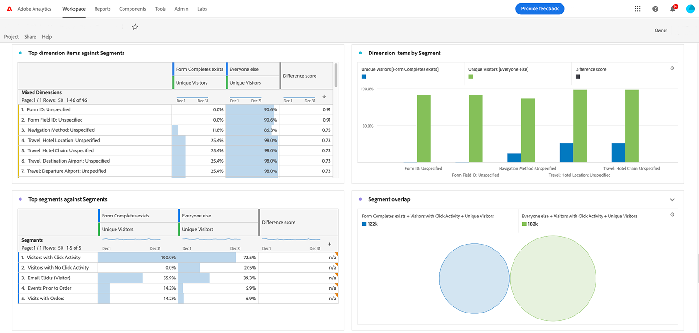

# 什麼是分析？{#what-is-analytics}

在您沉浸於 Adobe Analytics 的學習內容之前，了解「什麼是分析？」這個基本問題的答案會很有幫助。分析是一個廣義的術語，包含推動業務發展和轉型的多個學科，即業務分析和資料分析。兩者是有區別的。讓我們仔細看看。

## 業務分析的角色

近年來，將網際網路用於商業目的這個做法的出現和成熟呈爆炸式增長，組織收集的有關消費者如何與品牌互動和參與品牌的資料量也呈爆炸式成長。如果您之前聽說過巨量資料 (大數據) 這個詞，那麼這屬於業務分析領域。

業務分析是企業情報的一個組成部分，專注於宏觀戰略風險和機會。這是公司必須具備的能力才能在其產業中保持競爭力。

有四種類型的業務分析：

* **描述性**：這涉及使用歷史資料來識別組織業務的趨勢。例如，零售商需要在旺季或假期季節之前預測產品需求，並需要最佳化庫存來達成業務目標。
* **診斷性**：造成非預期結果的原因是什麼？為什麼在非旺季對產品或服務有巨大的需求？診斷性分析是描述性分析的一種更深層次的形式，旨在從資料中提取相關性。
* **預測性**：這是使用歷史資料來確定可能的結果或事件。機器學習 (ML) 和人工智慧 (AI) 通常用於更準確的預測。客戶流失是預測性分析實際應用的一個例子。此分析會找出相關性，這些相關性能夠識別可能流失的客戶其屬性，以便您採取措施防止流失客戶。
* **規範性**：這是一種進階形式的預測性分析，旨在發現達成所要結果的最佳途徑。這類型的分析也使用 ML 和 AI 技術。零售商使用規範性分析透過改變其運營方式來提高利潤。

## 資料分析的角色

資料分析使用許多與業務分析相同的技術，但範圍更廣，更具技術性。例如，巨量資料分析依賴資料的品質和組織。資料的排序、儲存和清理的效率如何？資料科學家在資料分析領域工作。他們轉換巨量資料集，然後業務分析師使用這些資料集將資訊傳達給組織，以最佳化流程和指標。資料科學家更深入地研究資料，確定趨勢和連結。

## Adobe Analytics 適用之處？

Adobe Analytics 是一個強大的資料分析平台，它從支援客戶歷程的多通道數位體驗中收集資料，並提供資料分析工具。它是行銷人員和業務分析師常用來進行業務分析的平台。

業務需求、資料設計和資料收集是有效分析做法的關鍵因素。最初，客戶收集關鍵客戶歷程的資料以及傳統數位體驗 (如 Web 和行動裝置) 的所要業務成果。資料應可提供以下問題的答案：

* 「哪些內容和內容類型受訪客歡迎？」
* 「哪些路徑會帶來高價值轉換，例如收入、預訂、潛在客戶或訂閱？」
* 「我應該向已知和未知的訪客顯示哪些產品、服務或內容？」
* 「數位行銷通道的表現如何？」

一旦將資料基礎收集到 Adobe Analytics 中，行銷人員和業務分析師就會使用產品中提供的各種報告和資料視覺化工具來執行分析並講述有關資料的有意義故事。此外，Adobe Analytics 提供各種形式的輸出。可以是傳送到最佳化工具 (如 Adobe Target) 以執行 A/B 測試的細分群體或客群。可以是一個預測分數，用於表示個人行為的可能性，此可能性供另一個系統用於建立模型。

隨著時間的推移，客戶會透過其他通道來源 (包括 CRM、呼叫中心、實體商店、語音助理等) 讓傳統 Web 和行動資料更為豐富。Adobe Analytics 提供了多種方法來從幾乎任何通道來源擷取資料，以建構強大的分析資料基礎。

收集額外的資料集為執行更進階的規範性資料分析打開了大門，這些分析使用機器學習或進階資料模式，例如行銷歸因和異常偵測。

我們鼓勵您參與 Experience League 的教學課程，引導您了解 Adobe Analytics 的主要優勢和功能。
